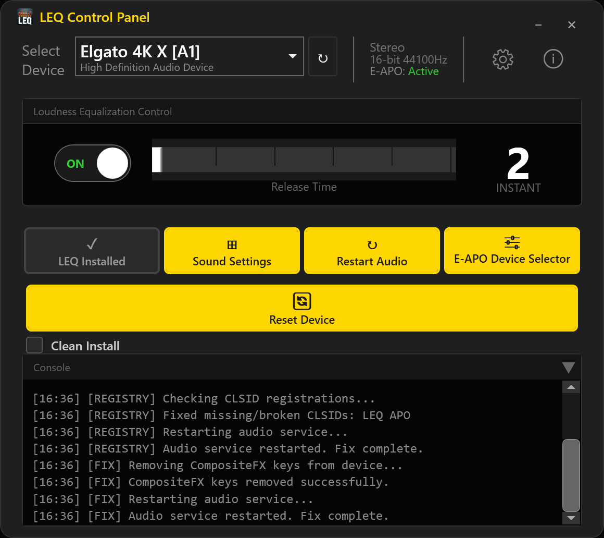

<p align="center">
 
</p>

<p align="center">
  <a href="LICENSE"></a>
  
  
</p>

# ArtIsWar's LEQ Control Panel

A standalone Windows application for registry-level **Loudness Equalization (LEQ)** control and installation. Toggle LEQ on/off instantly with no audio service restart required.

<p align="center">
  
</p>

## Features

- **LEQ Toggle:** Enable/disable Loudness Equalization with immediate effect
- **Release Time Control:** Adjust LEQ release time (2-7) with real-time Windows UI sync
- **LEQ Installation:** Install LEQ on devices without native enhancement support, with clean install and uninstall options
- **Device Management:** Switch between audio devices with automatic state detection and device change monitoring
- **E-APO Awareness:** Detects Equalizer APO and adjusts behavior — gates LEQ installation on E-APO device configuration, offers chain repair when conflicts are detected, and shows a neutral "Get E-APO" button that links directly to the download when E-APO is not installed
- **System Tray:** Minimize to tray with quick toggle, device info, and settings access
- **Headless Mode:** CLI flags for hotkey and shortcut integration (see below)
- **ArtTuneKit Integration:** Detects ArtTuneKit and defers device management when installed; shows an overlay on Art Tune devices with a button to launch ArtTuneKit directly
- **Auto-Update:** Checks GitHub releases for new versions on startup, with manual check available from the Settings menu
- **Update Integrity:** SHA256 hash verification for downloaded updates
- **Settings:** Run at startup, start minimized, always-on-top, configurable close behavior (minimize to tray / exit / ask), desktop shortcut management
- **Registry Health Checks:** Detects broken COM CLSID registrations and per-device CompositeFX keys blocking LEQ; the Install button turns red with a one-click fix that rewrites the affected registry entries
- **Post-Install Verification:** After installing LEQ, a guided dialog opens alongside Windows Sound Panel to walk you through confirming LEQ is active, with a Spatial Audio compatibility warning (Windows Sonic / Dolby Atmos / DTS:X will silently block LEQ)
- **Audio Format Display:** Shows the selected device's speaker layout (Stereo, 5.1, 7.1, etc.) and format details (bit depth, sample rate) in the device info strip
- **Activity Log:** A collapsible console panel logs all actions in real time with timestamps: device detection, installs, toggles, registry repairs, and color-coded warnings/errors
- **Smart Device Reset:** Adapts to device type. Voicemeeter devices are excluded (button disabled); VB-Audio and Hi-Fi virtual cables warn of full driver removal; physical devices with shared hardware endpoints list all affected sibling endpoints before proceeding
- **Utilities:** Open Windows Sound settings and restart Windows Audio service from within the app

## Requirements

- Windows 10 or 11 (x64)
- Administrator privileges (required for registry access)

The application is distributed as a self-contained single-file executable. No .NET runtime installation required.

## Usage

Launch `LEQControlPanel.exe` normally for the full GUI, or use command-line flags for headless operation:

| Flag | Description |
|------|-------------|
| *(none)* | Launch the GUI |
| `-silent` | Toggle LEQ on the preferred device and exit (no window) |
| `-toggle` | Same as `-silent` |

### Headless mode details

When launched with `-silent` or `-toggle`, the application:

1. Enumerates all audio render devices
2. Selects the device last chosen in the GUI (saved in the registry). Falls back to the first device with LEQ configured, then the first available device.
3. Toggles LEQ on/off on that device
4. Exits immediately

No window, splash screen, or tray icon is shown. If no devices are found or the toggle fails, the process exits silently. Headless mode skips the single-instance check, so it can run while the GUI is already open.

### Setting up a global hotkey

Windows does not natively support binding a global hotkey to an arbitrary executable, but you can use a shortcut:

1. Right-click your desktop and select **New > Shortcut**
2. Set the target to the full path of the executable with the `-toggle` flag:
   ```
   "C:\path\to\LEQControlPanel.exe" -toggle
   ```
3. Name the shortcut (e.g. "Toggle LEQ")
4. Right-click the new shortcut, open **Properties**
5. Click the **Shortcut key** field and press your desired key combination (e.g. `Ctrl+Alt+L`)
6. Under **Run**, select **Minimized**
7. Click **OK**

The hotkey will work globally as long as the shortcut remains on the desktop or in the Start Menu.

## Building from Source

**Prerequisites:** [.NET 8 SDK](https://dotnet.microsoft.com/download/dotnet/8.0) (Windows x64)

```bash
git clone https://github.com/ArtIsWar/LEQControlPanel.git
cd LEQControlPanel
dotnet build src/LEQControlPanel/LEQControlPanel.csproj -c Release
```

To publish a self-contained executable:

```bash
dotnet publish src/LEQControlPanel/LEQControlPanel.csproj -c Release -r win-x64 --self-contained true -p:PublishSingleFile=true -p:PublishTrimmed=false
```

> **Note:** The application requires administrator privileges to modify Windows audio registry settings. When debugging in VS Code or Visual Studio, run the IDE as administrator.

## Project Structure

```
LEQControlPanel.sln
src/
  LEQControlPanel/
    Program.cs                        # Entry point
    App.xaml(.cs)                     # Startup, single-instance, headless mode
    MainWindow.xaml(.cs)              # Primary UI and device management
    Dialogs/
      ConfirmationDialog.xaml(.cs)    # Close-behavior preference (tray vs exit)
      EapoWarningDialog.xaml(.cs)     # Pre-install E-APO conflict warning
      EapoChainFixDialog.xaml(.cs)    # E-APO chain repair prompt
      LeqVerifyDialog.xaml(.cs)       # Post-install LEQ verification wizard
      ResetDeviceWarningDialog.xaml(.cs)  # Smart device reset warnings
      StyledMessageBox.cs             # MessageBox API wrapper
      StyledMessageBoxWindow.xaml(.cs)  # Themed message box UI
    Windows/
      AboutWindow.xaml(.cs)           # Version, credits, embedded license viewer
      SplashWindow.xaml(.cs)          # Animated startup splash
      UpdateProgressWindow.xaml(.cs)  # Download progress with cancel support
    Utilities/
      DarkTrayMenuRenderer.cs         # Dark-themed system tray context menu
    Services/
      AudioService.cs                 # Registry-level LEQ operations via PowerShell
      DeviceChangeNotifier.cs         # Real-time device add/remove/state via COM
      SoundPanelHelper.cs             # Opens mmsys.cpl with clean device view
      UpdateChecker.cs                # GitHub release version check
      UpdateService.cs                # In-place update with SHA256 verification
    Models/
      AudioDevice.cs                  # Device model
  scripts/Modules/
    LEQ-Engine.ps1                    # PowerShell engine (embedded resource)
```

## Credits

- Original concept: [Falcosc/enable-loudness-equalisation](https://github.com/Falcosc/enable-loudness-equalisation)
- Extended implementation: [ArtIsWar](https://github.com/ArtIsWar)

## Third-Party Software & Acknowledgments

LEQ Control Panel does not bundle or redistribute third-party software.
It configures Windows audio system components and interacts with Equalizer APO if installed.

| Software / Technique | Role | License | Link |
|----------------------|------|---------|------|
| [Equalizer APO](https://sourceforge.net/projects/equalizerapo/) | Audio processing engine (LEQ installed as child APO) | GPL-2.0+ | [SourceForge](https://sourceforge.net/projects/equalizerapo/) |
| Microsoft WMALFXGFXDSP.dll | Windows system DLL providing loudness equalization APO | Microsoft (system component) | - |
| [Microsoft.PowerShell.SDK](https://www.nuget.org/packages/Microsoft.PowerShell.SDK) | In-process PowerShell engine for registry operations | MIT | [NuGet](https://www.nuget.org/packages/Microsoft.PowerShell.SDK) |

## License

This project is licensed under the **GNU General Public License v3.0**. See the [LICENSE](LICENSE) file for details.
